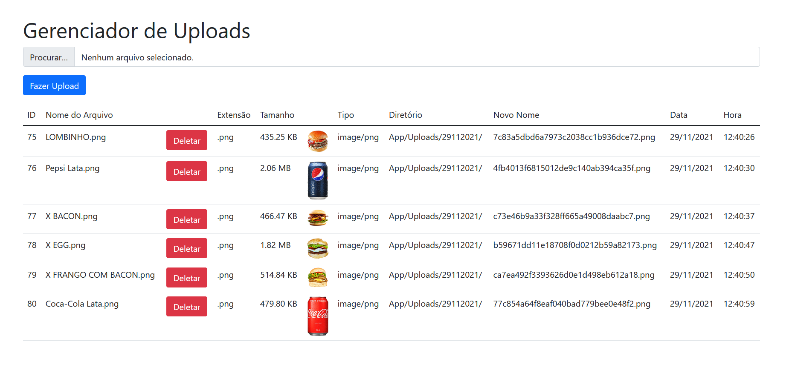

# Gerenciador de Arquivos em PHP
Este é um simples gerenciador de arquivos em PHP que permite aos usuários realizar operações básicas de gerenciamento de arquivos e pastas diretamente em seu servidor web. Com esta aplicação, você pode navegar, fazer upload, baixar, renomear e excluir arquivos e pastas de forma eficiente e intuitiva.

### Recursos
-  Navegação fácil e intuitiva no sistema de arquivos.
-  Upload de arquivos diretamente para o servidor.
-  Download de arquivos para o seu dispositivo.
-  Visualização de informações detalhadas sobre arquivos e pastas.

### Linguagens:
- Php 
- Html 
- Javascript
- Bootstrap
- Banco Mysql 

## Contato
Em caso de dúvidas ou sugestões, entre em contato através do email: paulo.rafael.jobs@gmail.com
